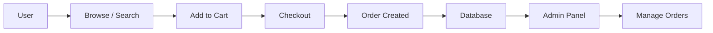

# 🛒 Blinkit Clone

### ⚡ Full Stack Grocery Delivery Web App (MERN)

A modern **Blinkit-inspired e-commerce platform** with real-world features like smart search, cart system, order management, and admin dashboard.

---

## 🌐 Live Demo

🔗 View Now: https://blinkit-clone-wi73.vercel.app/

---

## 📌 Table of Contents

* About the Project
* Features
* Tech Stack
* Project Structure
* Application Flow
* Quick Start
* Environment Variables
* API Overview
* Future Improvements

---

## 🧠 About the Project

This project is a **full-stack grocery delivery application** built using the MERN stack.

It simulates real-world e-commerce behavior including:

* 🛒 Cart & checkout system
* 📦 Order lifecycle
* 🔐 Authentication & protected routes
* 🧠 **Advanced smart search system**
* 👑 Admin panel for managing products & orders

👉 Built to demonstrate **production-level architecture and features**

---

## ✨ Features

### 👤 Customer Side

* 🔐 Authentication (Login/Register)
* 🔎 Smart search (spell correction + intent detection)
* 🛍️ Product browsing (category/subcategory)
* 🛒 Cart with quantity updates
* 💳 Checkout system
* 📦 Orders & order history
* 🏠 Address management

---

### 👑 Admin Side

* 📦 Product management (CRUD)
* 📂 Category & subcategory control
* 📊 Order management
* 🔐 Admin protected routes

---

## 🛠️ Tech Stack

### Frontend

* React (Vite)
* Redux Toolkit
* React Router
* CSS

### Backend

* Node.js + Express
* MongoDB + Mongoose
* JWT Authentication
* Cloudinary (image upload)

---

## 📁 Project Structure
### Frontend

```bash id="s1n2x3"

├── assets/
├── common/
│   └── summaryAPI.js
├── components/
│   ├── ProductDisplayPageComponent/
│   │   ├── Details.jsx
│   │   ├── ImageWrapper.jsx
│   │   ├── LargeViewImage.jsx
│   │   └── MoreDetails.jsx
│   ├── stylesheets/ # CSS files for Components
│   ├── AddFieldComponent.jsx
│   ├── AdminProductLoading.jsx
│   ├── AdminProtect.jsx
│   ├── ButtonLoading.jsx
│   ├── Cart.jsx
│   ├── CartItem.jsx
│   ├── CategoryWiseProduct.jsx
│   ├── ConfirmBox.jsx
│   ├── EditCategoryModal.jsx
│   ├── EditProductAdminModel.jsx
│   ├── EditSubCategoryModal.jsx
│   ├── Footer.jsx
│   ├── HandleQntUpdate.jsx
│   ├── Header.jsx
│   ├── HomeProductCard.jsx
│   ├── HomeProductLoading.jsx
│   ├── Loading.jsx
│   ├── LoginProtect.jsx
│   ├── NoInternet.jsx
│   ├── ProductCardAdmin.jsx
│   ├── ProtectedRoute.jsx
│   ├── Search.jsx
│   ├── SubCategoryTable.jsx
│   ├── UpdateCartItemQuantity.jsx
│   ├── UploadAddressModal.jsx
│   ├── UploadCategoryModal.jsx
│   ├── UploadSubCategoryModal.jsx
│   ├── UserProfileEdit.jsx
│   ├── ViewImage.jsx
│   └── calcBill.jsx
├── layout/
│   ├── Account.css
│   └── Account.jsx
├── pages/
│   ├── stylesheets/ # CSS files for pages
│   ├── AccountHome.jsx
│   ├── Address.jsx
│   ├── AdminOrders.jsx
│   ├── Category.jsx
│   ├── Checkout.jsx
│   ├── Home.jsx
│   ├── Login.jsx
│   ├── OrderDetails.jsx
│   ├── OrderSuccess.jsx
│   ├── Orders.jsx
│   ├── Privacy.jsx
│   ├── ProductAdmin.jsx
│   ├── ProductDisplayPage.jsx
│   ├── ProductListPage.jsx
│   ├── Profile.jsx
│   ├── Register.jsx
│   ├── SearchPage.jsx
│   ├── SubCategory.jsx
│   ├── SubCategoryWiseProducts.jsx
│   └── UploadProduct.jsx
├── store/
│   ├── addressSlice.js
│   ├── cartSlice.js
│   ├── orderSlice.js
│   ├── productSlice.js
│   ├── store.js
│   └── userSlice.js
├── utils/
│   ├── Search/
│   │   ├── CATEGORY_SYNONYMS.json
│   │   ├── buildSearchPlan.js
│   │   ├── createSpellIndex.js
│   │   ├── executeSearch.js
│   │   ├── extractEntities.js
│   │   ├── extractIntent.js
│   │   ├── getCorrectedQuery.js
│   │   ├── preProcessQuery.js
│   │   └── smartSearch.js
│   ├── ValidUrlConvert.js
│   ├── axios.js
│   ├── formatDate.js
│   ├── isAdmin.js
│   ├── isUser.js
│   ├── statusFinder.js
│   ├── sweetAlert.js
│   ├── uploadImage.js
│   └── userDetails.js
├── App.css
├── App.jsx
└── main.jsx
```
### Backend
```bash id="s1n2x3"
├── config/
│   ├── connectDB.js
│   └── multer.js
├── controllers/
│   ├── addressController.js
│   ├── cartController.js
│   ├── categoryController.js
│   ├── orderController.js
│   ├── productController.js
│   ├── sendEmail.js
│   ├── subCategoryController.js
│   ├── uploadImgController.js
│   └── userController.js
├── middleware/
│   ├── admin.js
│   └── auth.js
├── models/
│   ├── addressModel.js
│   ├── cartProductModel.js
│   ├── categoryModel.js
│   ├── orderModel.js
│   ├── productModel.js
│   ├── subCategoryModel.js
│   └── userModel.js
├── routes/
│   ├── addressRoute.js
│   ├── cartRoute.js
│   ├── categoryRoute.js
│   ├── orderRoute.js
│   ├── productRoute.js
│   ├── subCategoryRoute.js
│   ├── uploadRoute.js
│   └── userRoute.js
├── utils/
│   ├── cloudinary.js
│   ├── generateAccessToken.js
│   ├── generateRefreshToken.js
│   └── verifyEmailTemplate.js
├── .gitignore
├── index.js
├── package-lock.json
├── package.json
└── vercel.json
```

---

## 🔄 Application Workflow



---

## 🚀 Quick Start

### 1. Clone Repo

```bash id="clone12"
git clone https://github.com/madhav-gaur/blinkit-clone.git
cd blinkit-clone
```

---

### 2. Install Dependencies

```bash id="install12"
# frontend
cd Frontend
npm install

# backend
cd ../Backend
npm install
```

---

### 3. Run App

```bash id="run12"
# backend
npm run dev

# frontend
npm run dev
```

---

## 🔑 Environment Variables

### Backend `.env`

```env id="envb12"
FRONTEND_URL=your_frontend_url (http://localhost:5173)
MONGODB_URI=mongodb_uri

RESEND_API =resend_api

JWT_SECRET_ACCESS_TOKEN=jwt_access_token

JWT_SECRET_REFRESH_TOKEN=jwt_refresh_token

    
CLOUDINARY_CLOUD_NAME=cloud_name
CLOUDINARY_API_KEY=cloudinary_api
CLOUDINARY_API_SECRET=cloud_api_secret
CLOUDINARY_URL=cloud_url

ADMIN_EMAIL= # Register your mail and then change role to ADMIN from mongodb console
```

---

### Frontend `.env`

```env id="envf12"
VITE_API_URL=http://localhost:4000
```

---

## 🔍 Highlight Feature: Smart Search

Located in:

```bash id="search12"
utils/Search/
```

Includes:

* Query preprocessing
* Spell correction
* Intent detection
* Entity extraction

👉 Mimics real-world e-commerce search engines

---

## 📡 API Overview

### Products

* `GET /api/products`
* `POST /api/products`
* `PUT /api/products/:id`
* `DELETE /api/products/:id`

### Cart

* `GET /api/cart`
* `POST /api/cart/add`
* `POST /api/cart/remove`

### Orders

* `POST /api/orders`
* `GET /api/orders`

---

## 🚧 Future Improvements

* 💳 Payment integration (Razorpay/Stripe)
* 📍 Live tracking
* 🔔 Notifications
* 🌙 Dark mode

---

## 🤝 Contributing

Pull requests are welcome!

---

## ⭐ Support

If you like this project, give it a ⭐
